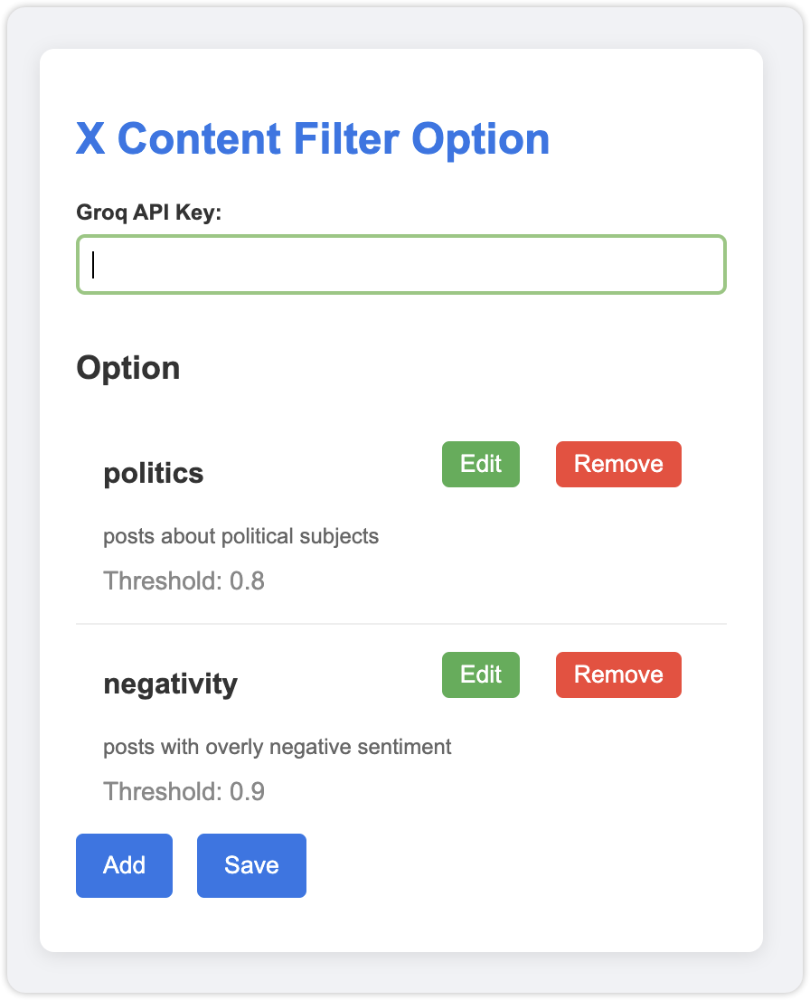

# X Content Filter

## Overview

The X Content Filter is a browser extension that analyzes and filters content on X.com based on configured topics. It uses the Groq API to perform the analysis.

## Installation

1. Clone the repository or download the source code.
2. Open your browser's extension management page (e.g., `chrome://extensions/` for Chrome).
3. Enable "Developer mode".
4. Click "Load unpacked" and select the source code directory.

## Usage

- The extension automatically analyzes and hides posts on X.com that exceed the configured thresholds using the Groq API.
- To reset the cache, run `resetCache()` in the browser console.

## Configuration

click the extension icon to open the option page.
follow the ui

## Files

- `manifest.json`: Extension manifest file.
- `content.js`: Main script for analyzing and filtering posts.
- `options.html`: Option page for configuring topics and thresholds.
- `options.js`: Option page logic for configuring topics and thresholds.

## Mobile

Use the [x-ai-filter-userscript.js](x-ai-filter-userscript.js) file to run the extension on mobile.

See the iOS Userscripts repo for more information:
https://github.com/quoid/userscripts

The latest version of the userscript is available at:
https://omba.nl/files/x-ai-filter/x-ai-filter-userscript.js

(And in this repo, but the above supports userscripts' update mechanism.)

